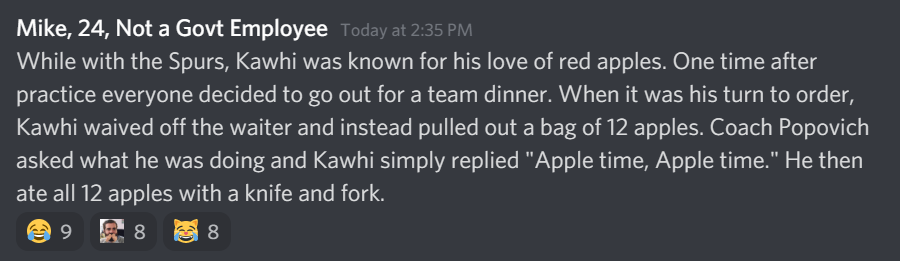
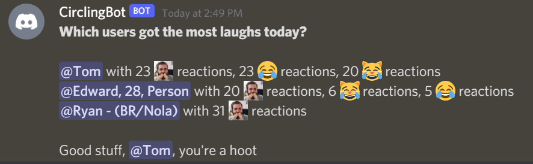

# Discord Reaction Analytics

[](https://github.com/tommyduggs/discord_reaction_anlytics)
## About

Discord reaction analytics is a configurable Python script that can be connected to a Discord bot. Message reactions are often a big part of a Discord community, with specific custom reactions often taking on their own meaning.

</img>

This script allows you to provide the members of a Discord server with fun metrics based on the reactions that are awarded to users. The script is flexible, allowing you to customize aspects such as which reactions should be counted, which channels to search in, and what the bot message should look like.



## Installation

1. Set up a Discord bot account on your server. [Follow these steps to create the bot and get the token needed to run the script.](https://discordpy.readthedocs.io/en/stable/discord.html)
2. Create a .env file with the bot token, your server name, and any additional configuration for your bot. Check the configuration section below for details on what can be configured.
3. If you haven't already, [install Python](https://www.python.org/downloads/). This script was created using Python 3.9.5.
4. Run the following commands to install required packages for the script to run
```
pip install discord.py
```
```
pip install python-dotenv
```
5. You're all set! You can run the script directly or you can set it up to run on a schedule using a cron job (Unix) or Windows Task Scheduler.

## Configuration

The .env file will allow you to customize the behavior of the app. The file .env.example lists all of the available keys that can be modified.

```
DISCORD_TOKEN=
DISCORD_GUILD=

CHANNELS_TO_SEARCH=[]
CHANNEL_TO_POST_IN=
COUNT_ALL_REACTIONS=True
MESSAGE_ABOVE_THRESHOLD=Congratulations, _user_mention_!
MESSAGE_BELOW_THRESHOLD=
MESSAGE_HEADER=Which users received the most reactions today?
MESSAGE_LIMIT=5000
NUMBER_OF_TOP_USERS=3
REACTION_LIST=[]
REACTION_THRESHOLD=0
SEARCH_ALL_CHANNELS=True
TIME_PERIOD=1
```
Here is an explanation of the available keys:
- **DISCORD_TOKEN**: The token that links to the bot you have created.
- **DISCORD_GUILD**: The name of the server you want the bot to run in
- **CHANNELS_TO_SEARCH**: A list of channels of channels to include in the search. Example: `['general-discussion','sports','video-games']`
- **CHANNEL_TO_POST_IN**: The name of the channel the bot should post the output message to
- **COUNT_ALL_REACTIONS**: Whether all reactions should be counted. If false, the script will only consider reactions listed in REACTION_LIST
- **MESSAGE_ABOVE_THRESHOLD**: A message to include after the top list of users. This is optional. The string *\_user_mention_* will be replaced with a tag for the top user. Example: `Congratulations, _user_mention_!` would resolve to `Congratulations, @Tom!`
- **MESSAGE_BELOW_THRESHOLD**: If there is a non-zero value for REACTION_THRESHOLD, this will be the message displayed at the end if the total number of reactions for the top user is under that threshold.
- **MESSAGE_LIMIT**: The limit on how many messages within the specified time period can be pulled from each channel
- **MESSAGE_HEADER**: The header for the message the bot sends to the server.
- **NUMBER_OF_TOP_USERS**: The number of users to include in the top users list
- **REACTION_LIST**: A list of the reactions that should be counted. This will only be used if COUNT_ALL_REACTIONS is set to false.
     - For custom emote reactions this will be the ID of the emote on the server, it will look something like this: `<:EmoteName:758492641102397460>`. You can get this ID by sending a message in Discord with a backslash followed by the name of the emote like so: `\:EmoteName:`
     - For standard emoji reactions this will be the codepoint for the emoji, it will look something like this: `U+1F602`. A good resource to find this is [emojipedia](https://emojipedia.org/).
     - They key with all of the values will look like this: `REACTION_LIST=['<:EmoteName:758492641102397460>','U+1F602','U+1F639']`
- **REACTION_THRESHOLD**: The total number of reactions the top user must meet in order to display the MESSAGE_ABOVE_THRESHOLD message. If set to zero the message will always be displayed.
- **SEARCH_ALL_CHANNELS**: Whether or not to search all available channels. If false, the script will only consider channels listed in CHANNELS_TO_SEARCH
- **TIME_PERIOD**: How far back (in days) the script should pull messages from for the reaction count

## License

Distributed under the MIT License. See `LICENSE` for more information.
